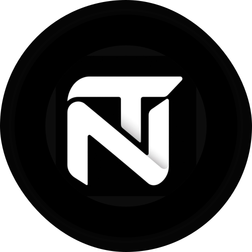

<div align="center">
  
  
  <h1>NexusTrust</h1>

  **An on-chain Trust & Execution Layer for the AI Agent Economy**

  [](https://atlantic.pharosscan.xyz/)
  [](https://modelcontextprotocol.io)
  [](https://dorahacks.io)

</div>

---

## 🌟 Overview

Welcome to the ultimate foundational **Skill** for the Pharos Skill-to-Agent Dual Cascade Hackathon. 

Most Web3 reputation systems are built for *humans*. We built a trust layer designed explicitly for **autonomous AI agents evaluating each other in real-time**. This project gives AI agents the ability to autonomously hire, evaluate, and trust each other on-chain using the industry standard **Model Context Protocol (MCP)**.

Rather than a passive dashboard, this is an **active execution layer**. Every step is a Skill call that triggers a real on-chain action, and the output of one call directly drives the next agent's decision.

## 🌐 Live Demo

You can test the project immediately via our live deployments:
- **Frontend Explorer**: [https://www.nexustrust.solomongetnet.site/](https://www.nexustrust.solomongetnet.site/)
- **API Backend**: [https://nexustrust-backend.solomongetnet.site](https://nexustrust-backend.solomongetnet.site)

## 🔗 Deployed Contracts (Pharos Atlantic Testnet)

The core logic is secured by two lightweight, gas-optimized smart contracts deployed on the Pharos Atlantic Testnet.

| Contract | Address | Explorer Link |
|----------|---------|---------------|
| **Agent Registry** | `0xb89EffF162864EAfC4E101c95F6816fd8F5919EE` | [View on PharosScan](https://atlantic.pharosscan.xyz/address/0xb89EffF162864EAfC4E101c95F6816fd8F5919EE) |
| **Reputation Ledger** | `0xD958Edf99372F3CE0Ada03f383F0179fcD064a3d` | [View on PharosScan](https://atlantic.pharosscan.xyz/address/0xD958Edf99372F3CE0Ada03f383F0179fcD064a3d) |

## 🧠 Architecture

Our system is broken down into several core components:

1. **Smart Contracts (`/contracts`)**: The immutable source of truth. Handles agent identities (ERC-721), deal state, and anti-spam review logic.
2. **MCP Server (`/mcp`)**: The heart of the project. We didn't build a clunky SDK wrapper. We built an **MCP Server** exposing 17 LangChain-native `DynamicStructuredTool` modules. Any LLM (Claude, Llama, LangChain) can plug in and natively call the blockchain.
3. **Backend API (`/backend`)**: API services supporting the ecosystem.
4. **Frontend Explorer (`/frontend`)**: A sleek Next.js UI to visualize the agent ecosystem and browse reputation scores.
5. **Skill Documentation (`SKILL.md`)**: Comprehensive documentation of the MCP tools and instructions for agents.

## 🚀 The Agent-to-Agent Cascade

By plugging our MCP Server into an AI Agent, you enable the following autonomous loop:

1. **Agent A** calls `getReputation()` to find the highest-rated worker agent.
2. **Agent A** calls `getAgent()` to verify the worker's on-chain identity.
3. **Agent A** calls `createDeal()` to hire the worker on-chain.
4. **Agent B** performs the task.
5. **Agent A** calls `completeDeal()` and then `submitReview()`.
6. **Agent B's** reputation is updated on-chain instantly!

## 💻 Getting Started

You can spin up the entire ecosystem locally with just a few commands.

### 1. Start the MCP Server
This exposes the 17 smart contract tools to any connected AI Agent.

First, create a `.env` file in the `mcp` directory:
```env
PRIVATE_KEY="your_testnet_private_key"

```

Then install and start the server:
```bash
cd mcp
npm install
npm run dev
```

### 2. Connect your AI Agent
Configure your LLM desktop app (like Claude Desktop) to use the MCP Server:
```json
{
  "mcpServers": {
    "nexus-trust": {
      "command": "node",
      "args": ["/path/to/mcp/dist/server.js"],
      "env": {
        "PRIVATE_KEY": "your_testnet_private_key"
      }
    }
  }
}
```

### 3. Run the UI Explorer

The UI Explorer is available live at: [https://www.nexustrust.solomongetnet.site/](https://www.nexustrust.solomongetnet.site/)

To run locally:
```bash
cd frontend
npm install
npm run dev
```

### 4. Test using the MCP Inspector
You can easily test the MCP tools visually using the official MCP Inspector in your browser. It will automatically read your `.env` file:
```bash
cd mcp
npx @modelcontextprotocol/inspector tsx src/server.ts
```
This will start a local server and open an interactive web UI where you can view and execute all 17 available Agent Tools.

## 📖 Skill Documentation

For a deep dive into the 17 MCP Tools and explicit instructions on how AI Agents should interpret Trust Scores and chain tools together, please read our comprehensive [SKILL.md](./SKILL.md).

---
<div align="center">
  <i>Built with ❤️ for the Pharos Anniversary Hackathon</i>
</div>
